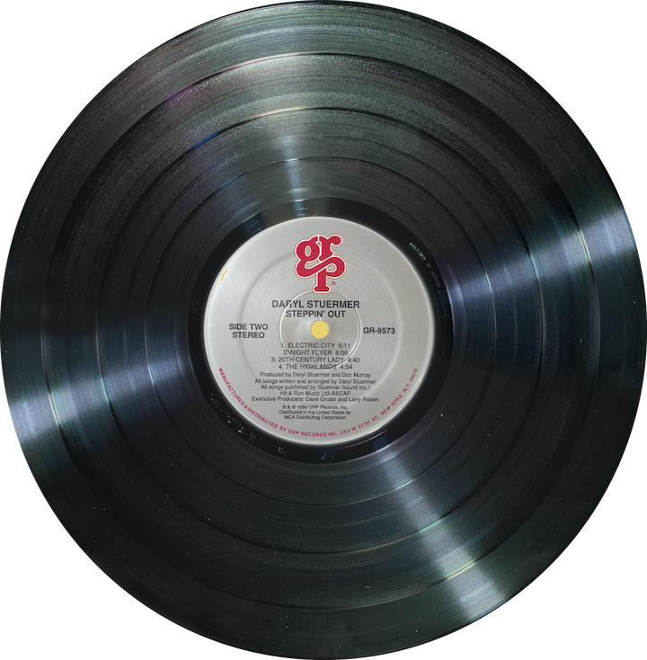

## The Cupid Shuffle:
### Can music "play cupid"?

When it comes to compiling the ultimate playlist of the heart, the question arises: Are some music genres more romantic than others? 

### The recipe so far for sussing out the answer with data science:  
- Top romance playlists from Country, Hip Hop, Rap and Classics.
- Music lyric extraction with Python, courtesy of the GENIUS Developer API
-  Machine learning processing with the NLTK library to count word frequencies.

### "We've only just begun." 
This is the initial repository for a work in progress and contains:
- Temporary splash page where the song "Cupid Shuffle" can be viewed courtesy of Youtube.
-  Python script to extract lyrics for top rated Hip Hop romantic songs. 
###
For more on this topic, check out this article:  <a href ="https://theblog.okcupid.com/https-theblog-okcupid-com-dating-deal-breakers-music-e9bc60c95222">Understanding Deal Breakers: The Psychology of Music and Romance"</a>

